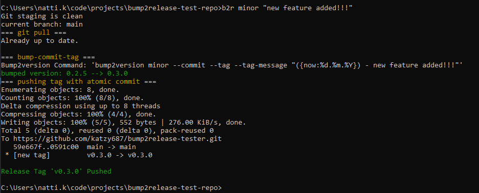
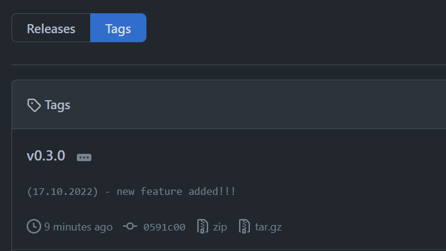

[](https://www.python.org/downloads/release/python/)
[](https://github.com/katzy687/bump2release/actions/workflows/lint-test.yml)
[](https://badge.fury.io/py/bump2release)
[](https://pepy.tech/project/bump2release)

# bump2release

A CLI utility extension of [bump2version](https://github.com/c4urself/bump2version) that will push release tag to git remote in same flow.

### Installation

```
pip install bump2release
```

### Basic Usage

1. Merge all feature branches to release branch. Either by pull request on remote, or local merge
2. Run bump2Release (alias b2r), passing [SEMVER](https://semver.org/) release type (Major/Minor/Patch), and message for annotated tag

CLI Usage:
```commandline
usage: bump2release [-h] bump_type tag_message

positional arguments:
  bump_type    Major / Minor / Patch etc.
  tag_message  annotated tag message

optional arguments:
  -h, --help   show this help message and exit

```

Sample Command
```commandline
bump2release minor "new feature added"
```

CLI Output: 
<br>



Sample Github Result: 
<br>



### Command Flow Details
1. Validate that git staging isn't dirty
2. Validate that script is running from main/master/dev branch
3. Pull latest changes from upstream (if feature branch was just merged)
4. Leverage bump2version to bump version files, commit the change, and create matching annotated tag
5. Push newly created tag to git remote (which can kick off a publish CI action)


### Notes
- A `version.txt` file is required
- Additional files can optionally be specified in [.bumpversion.cfg](https://pypi.org/project/bumpversion/)

### License

Free Software: MIT License